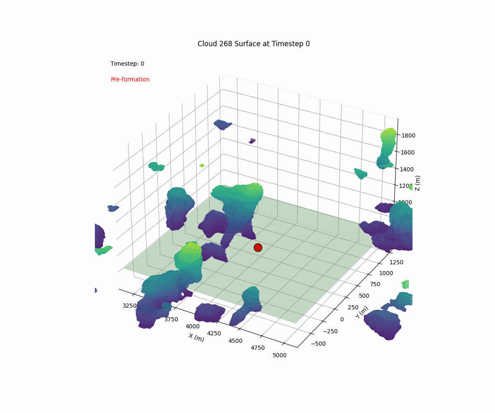

# LES Cloud Tracking and Analysis code

## Description and Aim
This project provides Python code designed for the processing, tracking, and analysing of LES cloud data. The aim is to facilitate easy and efficient analysis of cloud dynamics and properties over time.

Currently configured for the [RICO case](https://doi.org/10.1175/BAMS-88-12-1912). Setups for LBA and RCE setups will be added soon. 

## About the code
The code tracks and analyses cloud data, including cloud volume, surface area, cloud base size, near environment of each cloud and many others (see [src/netcdf_writer.py](src/netcdf_writer.py) for all). It accounts for wind drift between time steps and works for biperiodic domains. It allows for user choice of cloud identification thresholds. Some features and internal workings:
- Overlap & matching. Drifts the cloud's surface (optionally with multiple inside shells) from last timestep to current timestep by the cloud’s mean velocity. Uses that to check overlap with a KD-tree of current timestep. Requires minimum number of overlap points.
  - Prefilter. Before overlap, reduces the number of candidates by min distance search radius based on max speed (configurable). Optional full-domain search if no candidates.
- Merges & Splits.
  - Merges. Oldest parent continues; the child takes the age of parent. Others go inactive with merged_with flag.
  - Splits. One child continues, others start new tracks with age = parent + 1 and have split_from flag. 
- Tainting (removal of partial lifetimes). Any cloud present at t=0 is tainted. Anything then merging into a tainted cloud becomes tainted. Any cloud still-active at final step is also tainted. Set by a valid_track flag. 
- Biperiodicity. When identifying clouds, the code merges labels on opposite edges if edge points are within a threshold (configurable) in order to prevent artificial splits across boundaries. 
- Near-environment rings. For each cloud and each level, tracks Manhattan distance rings and stores mean fields. 
- Config. Key user inputs: thresholds, grid/time scales, knobs for matching (min overlaps, shells, safety), prefilter switched, base diagnostics, environment-ring settings.


## Summary of modules
0. **analysis/input_field_statistics.ipynb**: Inspects basic characteristics of input data.
1. **main.py**: Workflow oversight, paramater configration and managing other modules.
2. **src/data_management.py**: Data loading and preprocessing of NetCDF data.
3. **lib/cloud.py**: Cloud object used across modules.
4. **lib/cloudfield.py**: Identifies cloud objects in the loaded dataset.
5. **lib/cloudtracker.py**: Tracks and analyses temporal changes of clouds in cloudfield.
6. **src/netcdf_writer.py**: Writes data to NetCDF files. 
7. **analysis/output_analysis_general.ipynb**: Basic analysis for RICO run.
8. **analysis/output_analysis_vertical_profiles.ipynb**: Analysis of vertical profiles. 

There are many more (mostly unorganised) analysis notebooks under `analysis/`. They need a tidy-up first. 

##  Running this code 
1. Instal requirements. 
```bash
pip install -r requirements.txt
```
2. Set config file in main.py
3. Set correct paths to LES data.
4. Run with `python main.py`
5. To inspect output run analysis/output_analysis.ipynb notebook.


### With memory profiler
- Run with `python -m memory_profiler script_name.py`
- Or`mprof run main.py`. Then plot using `mprof plot`
- Warning: Do NOT run for the entire dataset (far too expensive). 


## Plotting & Visualisation
All tools use the NetCDF produced by `main.py` (`cloud_results.nc`). Most scripts assume the file is in the repo root and unfortunately a few use relative defaults like `../cloud_results.nc`. Run them as they are from `analysis` or pass `--nc` explicitly. By default, partial (tainted) tracks (`valid_track=0`) are excluded in most.


Lifecycle of a cloud that detaches from cloud base. Tracked through time with view drifting with prevailing winds. 

### Scripts
- Basic stats + lifecycles (saves PNGs in `analysis_output/`):
  - `python analyse_clouds.py cloud_results.nc --output-dir analysis_output --min-timesteps 3 --min-size 10`
  - Outputs: `track_statistics.png`, `cloud_lifecycles.png`

- 3D track explorer:
  - `python analysis/cloud_3d_visualizer.py`
  - Interactive.

- Detaching base visualisations (saves to `analysis/detaching_cloud_visualizations/`):
  - `cd analysis && python base_detachment_cloud_visual.py`
  - Interactive: prompts to choose a cloud.

- Base lowering visualisations (saves to `analysis/lowering_cloud_visualizations/`):
  - `python base_lowering_cloud_visual.py`

- High-base / non‑LCL initiation (saves to `analysis/cloud_surface_visualizations/`) — Experimental:
  - `python non_LCL_cloud_visual.py`
  - Reads the original LES liquid water field. Set `base_file_path` and filenames at the top.


### Notebooks
Many other notebooks exists, none of which have been tidied up yet. Some are listed here:
- [Output Analysis — General](analysis/output_analysis_general.ipynb)
- [Output Analysis — Vertical Profiles](analysis/output_analysis_vertical_profiles.ipynb)
- [Output Analysis — Environment](analysis/output_analysis_environment.ipynb)
- [Output Analysis — Mass Flux](analysis/output_analysis_mass_flux.ipynb)
- [Output Analysis — Cloud Base](analysis/output_analysis_cloudbase.ipynb)
